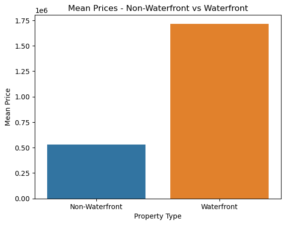

## OVERVIEW
For this project, I will focus on a real estate agency that helps homeowners buy and sell homes. The business problem I will address is the need to provide advice to homeowners about how home renovations might increase the estimated value of their homes, and by what amount.

## Business Problem
The business problem is to optimize the selling process for homeowners by providing them with data-driven insights and recommendations on how to increase the value of their homes, attract potential buyers, and achieve higher selling prices. The goal is to empower homeowners with the knowledge and strategies to make informed decisions about home renovations and improvements that can maximize their return on investment.

Stakeholders:

Homeowners: The primary stakeholders are homeowners who are looking to sell their properties. They want to sell their homes at the highest possible price and are seeking guidance on renovations and improvements that can enhance their home's value and market appeal.

Real Estate Agents: Real estate agents play a crucial role as intermediaries between homeowners and potential buyers. They are responsible for listing and marketing properties, negotiating deals, and advising homeowners on strategies to increase the value of their homes. Providing them with accurate and data-backed recommendations can enable them to better serve their clients and achieve successful sales.

## Data Understanding
The dataset I will use is the King County House Sales dataset, which contains information about house sales in a northwestern county. The dataset is provided in the kc_house_data.csv file in the data folder of the project's GitHub repository.

### Column Names and Descriptions for King County Data Set
* `id` - Unique identifier for a house
* `date` - Date house was sold
* `price` - Sale price (prediction target)
* `bedrooms` - Number of bedrooms
* `bathrooms` - Number of bathrooms
* `sqft_living` - Square footage of living space in the home
* `sqft_lot` - Square footage of the lot
* `floors` - Number of floors (levels) in house
* `waterfront` - Whether the house is on a waterfront
  * Includes Duwamish, Elliott Bay, Puget Sound, Lake Union, Ship Canal, Lake Washington, Lake Sammamish, other lake, and river/slough waterfronts
* `view` - Quality of view from house
  * Includes views of Mt. Rainier, Olympics, Cascades, Territorial, Seattle Skyline, Puget Sound, Lake Washington, Lake Sammamish, small lake / river / creek, and other
* `condition` - How good the overall condition of the house is. Related to maintenance of house.
  * See the [King County Assessor Website](https://info.kingcounty.gov/assessor/esales/Glossary.aspx?type=r) for further explanation of each condition code
* `grade` - Overall grade of the house. Related to the construction and design of the house.
  * See the [King County Assessor Website](https://info.kingcounty.gov/assessor/esales/Glossary.aspx?type=r) for further explanation of each building grade code
* `sqft_above` - Square footage of house apart from basement
* `sqft_basement` - Square footage of the basement
* `yr_built` - Year when house was built
* `yr_renovated` - Year when house was renovated
* `zipcode` - ZIP Code used by the United States Postal Service
* `lat` - Latitude coordinate
* `long` - Longitude coordinate
* `sqft_living15` - The square footage of interior housing living space for the nearest 15 neighbors
* `sqft_lot15` - The square footage of the land lots of the nearest 15 neighbors

## Modeling

#### Correlation heatmap

Sqft_living has the highest correlation to price.

### Sqft_living vs price

The diagram shows relationship between Square Footage of Living Space and Price for the dataset.As this shows it linear relationship it does not account for other variables such as waterfront or grade of property as this is the most affected by price.

### WaterFront Property or No WaterFront property?

Average price for a property with waterfront is much higher than those without.

Coefficient for waterfront_YES suggests that, having a waterfront property is associated with an increase in price of approximately 0.7461 units.

Average price of a home with a high grade exa grade 13 Mansion is the highest.

Coefficient for grade 13 Mansion, suggests that, having a mansion is associated with an increase in price of approximately 1.455 Telling us that a higher grade affects price.

### Final Model

### Results 

Our model is statistically significant overall, with an F-statistic 2137.
The model is 49.7% of the variance in the target variable(price).
Grade 13 Mansion has the highest coefficient to price(1.455)

The higher the grading of a property, the higher the price. Instance Grade 13 Mansion will attract 3,710,769 Average Price.
While a property on water will attract 17,172,145 Average Price.

## Conclusion

To increase Value of Property so as to sell at the highest price possible, the Real estate Company should advise their homeowners the following 

Grade is the Most important factor to consider.
Followed by Waterfront.

## Recommendation

Use higher quality materials (interior and exterior) to increase value of property. Eg Flooring, roofing. And the property should be well constructed to avoid grade being affected negatively.
Having Property near water also significantly increases Price.

